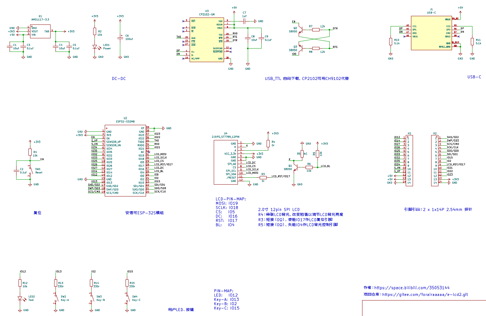

# E-LCD2

超级容易复刻，板载 2.0 寸 LCD 屏幕的 ESP32 核心板~

因为项目有 ESP32 + lcd 屏幕需求，所以干脆画个板载 LCD 的 ESP32 核心板，也刚好拿Kicad6练练手~

视频介绍：https://www.bilibili.com/video/BV13i4y197NZ

#### 核心板资源

- 安信可 ESP-32S 模组，焊接友好
- USB-C 接口，基于 CP2102（CH9102）USB-TTL 自动下载
- 复位按键、3 颗用户按键
- 2.0 寸 SPI LCD， 分辨率 240*320
- 引出绝大部分 IO

#### 缺点

- 没有板载 PSRAM ，所以单板不适合用于特别复杂的图形应用
- 用户按键所使用的 IO 为 ESP32 模组内部的 ADC2 复用引脚，在使用 WIFI 时要注意
- IO 口的排针引出没有标注丝印，作开发板玩时可能会有点麻烦 

#### 焊接注意

- 板子上 R5 默认不焊接，短接后 LCD 背光默认开启，不受引脚控制
- 板子上 R3 默认焊接，短接后 LCD 可以由引脚控制复位，避免出现上电后需要对板子手动复位， LCD 才能正常显示的问题
- 建议使用加热台，会方便很多~

#### 引脚定义

| 功能     | 引脚                                                 |
| -------- | ---------------------------------------------------- |
| LCD_MOSI | IO19                                                 |
| LCD_SCLK | IO18                                                 |
| LCD_CS   | IO5                                                  |
| LCD_DC   | IO16                                                 |
| LCD_RST  | IO17                                                 |
| LCD_BL   | IO4 （有复用风险？但目前没发现问题，下版本应该会换） |
| 用户按键 | 板子丝印有标注~                                      |

#### 例程

由于 LCD 涉及的配置文件比较多，例程中的库路径没有 ignore ~ 可以参考我的配置自行修改~~

#### 原理图

